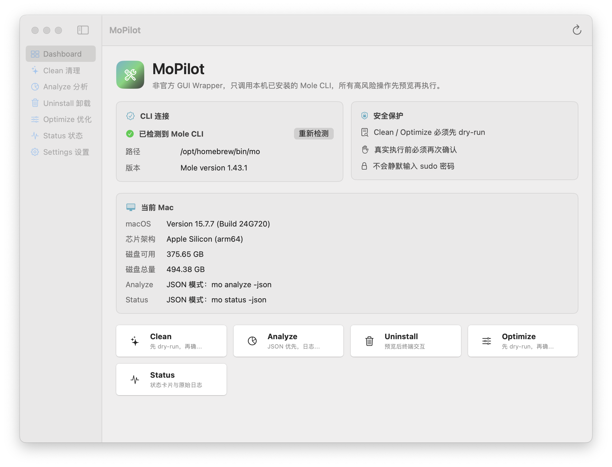

# MoPilot

MoPilot is an unofficial GUI wrapper for the Mole CLI. It is not affiliated with, endorsed by, or sponsored by the Mole project.

MoPilot 是一个 macOS 图形界面工具，只调用本机已安装的 Mole CLI (`mo`)。它不内置 `mo`，不复制 Mole 源码，不复刻 Mole 官方 Mac App，也不使用 Mole 官方品牌资产。



## Features

- 原生 SwiftUI macOS App，目标 macOS 13+
- 启动时执行 `/usr/bin/env which mo` 检测 Mole CLI
- Dashboard 展示 CLI 状态、版本、Mac 信息、磁盘空间和安全保护状态
- Clean / Optimize 必须先 dry-run，真实执行前再次确认
- Analyze / Status 优先使用 JSON 输出构建表格和状态卡片
- 当前 Mole CLI 不支持 JSON 参数或解析失败时，自动降级为原始日志
- Uninstall 先 dry-run 预览，真实卸载只打开 Terminal.app 交互运行
- 命令 stdout / stderr 实时显示，可取消、可复制、可保存日志
- 日志默认保存到 `~/Library/Logs/MoPilot/`

## Install Mole CLI

MoPilot only calls the locally installed Mole CLI. Install it first:

```bash
brew install mole
```

If `mo` is not found, MoPilot will show an install hint and a retry button.

## Build

Build with SwiftPM:

```bash
swift build
```

Build a local `.app` bundle:

```bash
./build.sh
```

The app bundle is created at:

```text
dist/MoPilot.app
```

Build a release DMG:

```bash
./create-dmg.sh
```

The DMG is created at:

```text
dist/MoPilot.dmg
```

## Run

From this repository:

```bash
./script/build_and_run.sh
```

Or open the built app:

```bash
open "dist/MoPilot.app"
```

## Safety Model

- MoPilot does not modify system files on launch.
- Clean and Optimize require a successful dry-run preview before real execution.
- Clean, Optimize, and Uninstall show confirmation before higher-risk actions.
- MoPilot never silently enters a sudo password.
- Interactive uninstall is delegated to Terminal.app so the user remains in control.
- MoPilot stores its own command logs under `~/Library/Logs/MoPilot/`.

## JSON Detection

MoPilot checks runtime capabilities with:

```bash
mo analyze --help
mo status --help
```

It supports both `--json` and `-json`. If neither flag is available, or if JSON parsing fails, MoPilot falls back to plain `mo analyze` or `mo status` and displays the raw log.

## License

MoPilot is released under GPL-3.0. See [LICENSE](LICENSE).

Mole CLI is a separate project. Review the Mole project for its own license, trademark policy, and safety guidance:

- <https://github.com/tw93/Mole>
- <https://github.com/tw93/Mole/blob/main/TRADEMARK.md>
